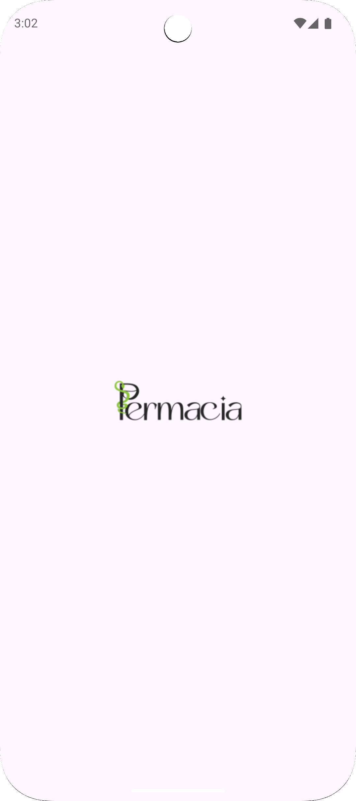
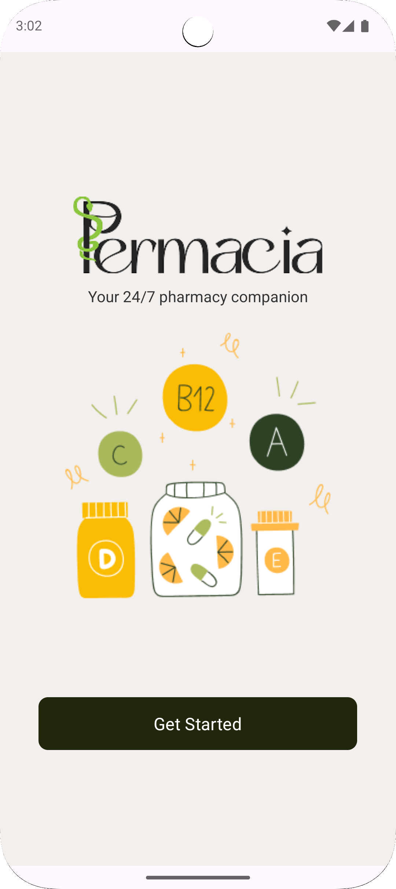
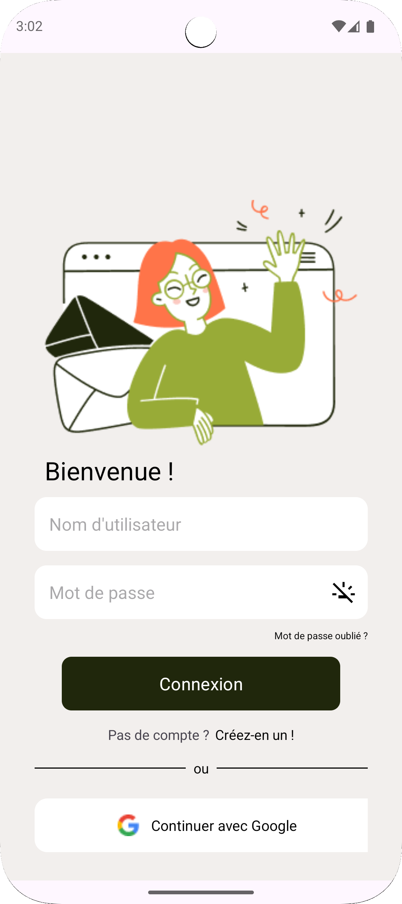
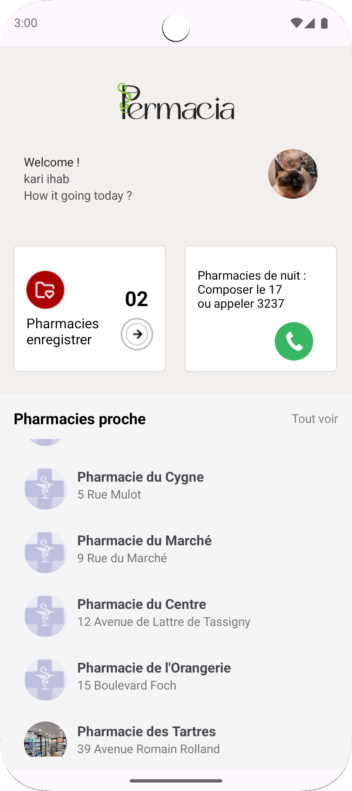
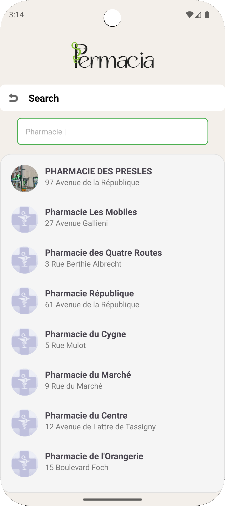
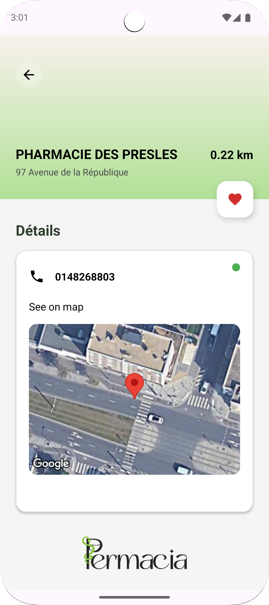
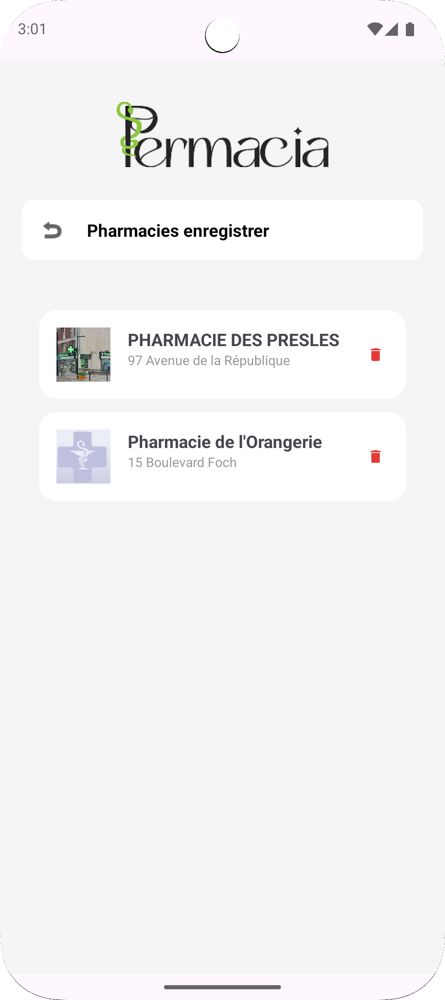
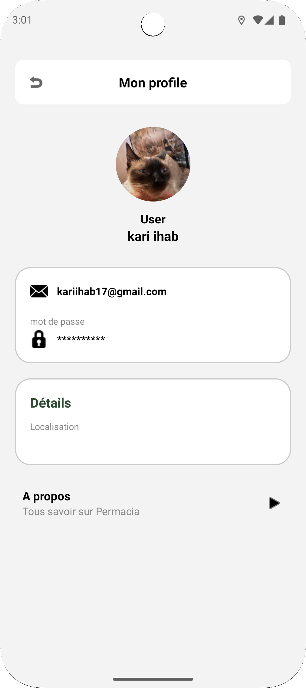

  
 
<b>Permacia</b> — Your 24/7 Pharmacy Companion

  
 
<b>Permacia</b> — Your 24/7 Pharmacy Companion

Permacia is a 24/7 pharmacy companion Android application that helps users find nearby pharmacies quickly and easily. 

## Features

- Find pharmacies near your location
- View pharmacy details and information
- Save favorite pharmacies
- User profile management
- Google Maps integration for easy navigation

## Technologies

- Kotlin
- Android SDK
- Firebase (Authentication, Realtime Database, Firestore, Storage)
- Google Maps API

## Screenshots

<table>
  <tr>
    <td align="center">
      
       
      <b>Splash Screen</b>
       
      <i>Première interface du lancement</i>
    </td>
    <td align="center">
      
       
      <b>Get Started</b>
       
      <i>Interface de bienvenue</i>
    </td>
  </tr>
  <tr>
    <td align="center">
      
       
      <b>Connexion</b>
       
      <i>Page de connexion</i>
    </td>
    <td align="center">
      
       
      <b>Home</b>
       
      <i>Page d'accueil</i>
    </td>
  </tr>
  <tr>
    <td align="center">
      
       
      <b>Recherche</b>
       
      <i>Recherche des pharmacies</i>
    </td>
    <td align="center">
      
       
      <b>Détails Pharmacie</b>
       
      <i>Page de pharmacie</i>
    </td>
  </tr>
  <tr>
    <td align="center">
      
       
      <b>Favoris</b>
       
      <i>Pharmacies enregistrées</i>
    </td>
    <td align="center">
      
       
      <b>Profil</b>
       
      <i>Page du profil</i>
    </td>
  </tr>
</table>

## Usage

If you would like to use this application or its code, please contact me at:  **contact. kariihab@gmail.com**
